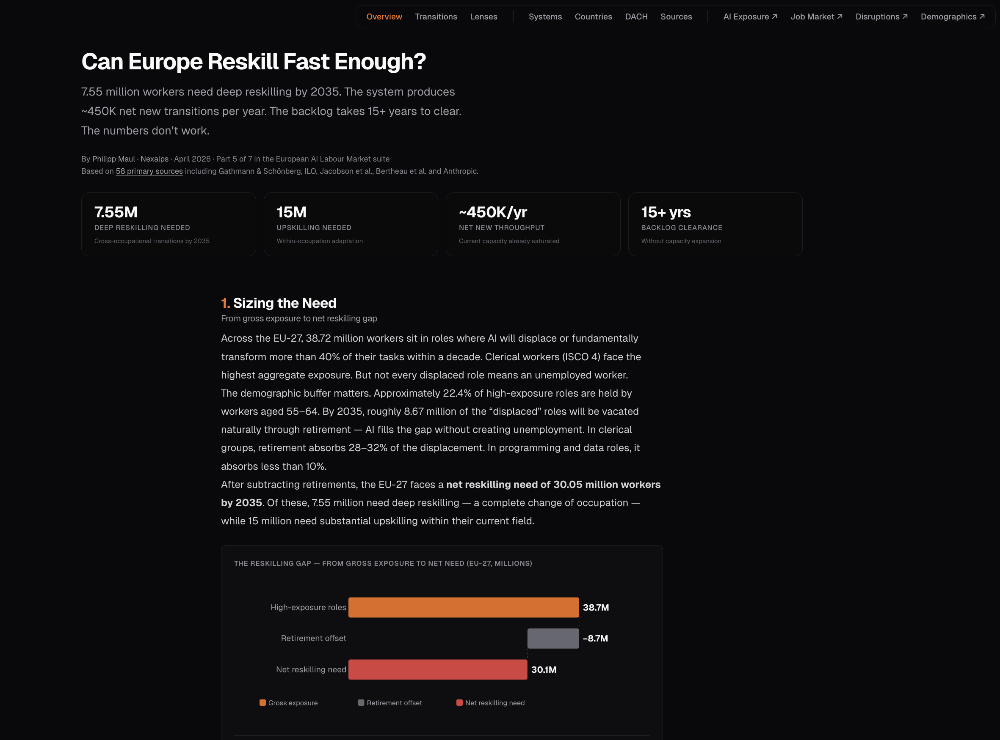

# Can Europe Reskill Fast Enough?

The reskilling gap that determines whether Europe absorbs the AI transition or fragments under it. Part 5 of 7 in the European AI Labour Market suite. Companion to the [AI Exposure Map](https://github.com/Ph1lM4/ai-job-impact-europe), [Job Market Map](https://github.com/Ph1lM4/job-market-europe), [Disruptions Map](https://github.com/Ph1lM4/european-disruptions-map), and [Demographics Map](https://github.com/Ph1lM4/european-demographics-map).

**What makes this different:** Most reskilling commentary stops at "we need more training." This project sizes the actual capacity gap against the actual need, then asks the harder question the data exposes — that the bottleneck has moved from skill **acquisition** (knowledge is abundant and free) to skill **evaluation** (the credentialing and role-translation machinery operates on pre-digital institutional timelines). 7.55M workers need deep reskilling by 2035; the system produces ~450K net new transitions per year. The numbers don't work inside the current systems.



## Live Site

**[reskilling.nexalps.com →](https://reskilling.nexalps.com)** *(static site, no backend)*

## What's Included

| Page | Description |
|------|-------------|
| [Overview](https://reskilling.nexalps.com/) | Sizing the gap — 38.72M gross exposure, 8.67M retirement offset, 30.05M net need, 7.55M deep / 15M upskilling / 7.5M partial split, 3.34M throughput, 450K net new, 5–9 year speed gap |
| [Transitions](https://reskilling.nexalps.com/transitions.html) | The bridge nobody can walk — skills distance 6.8/10, certification walls 12–42 months, wage cliff −25% to −40%, displaced-worker flow Sankey, manufacturing parallel |
| [Lenses](https://reskilling.nexalps.com/lenses.html) | Six practitioner and research views (Haslauer, Klinger, Ronacher/Poncela Cubeiro, Weber, Andreessen) with a self-honest heat-map of where each finds support in the data, three confounders the aggregate hides, and one candidate diagnostic metric for firms |
| [Systems](https://reskilling.nexalps.com/systems.html) | Six European reskilling models ranked across speed, scale, quality, equity, funding — Nordic flexicurity 8–12%, Germanic Dual 3–6%, Southern 2–5%. Singapore SkillsFuture as external benchmark, three policy interventions plus the soft-power-vs-hard-regulation lever question |
| [Countries](https://reskilling.nexalps.com/countries.html) | DE/FR/IT/ES/UK/AT/CH drilldown — gross exposure, retirement buffer share, per-capita intensity against Layer 4 working-age population |
| [DACH](https://reskilling.nexalps.com/dach.html) | Germany / Austria / Switzerland deep dive — 7.71M net need, grounded retirement-offset deltas, Germanic Dual sensitivity (Derivation Appendix G), reform-velocity composite (DE 5, AT 3, CH 1) |
| [Sources](https://reskilling.nexalps.com/sources.html) | 63 primary sources with tier ratings, key limitations, and the Derivation Appendix (A–H) reproducing every headline number from local datasets |
| [llms.txt](https://reskilling.nexalps.com/llms.txt) | Machine-readable project summary |

## Key Findings

- **38.72M EU-27 workers** sit in high-exposure ISCO groups; **8.67M absorbed by retirement by 2035**; **30.05M net reskilling need**
- Of the net need: **7.55M deep cross-occupational reskilling**, **15M within-occupation upskilling**, **7.5M partial task change**
- Annual capacity is **3.34M qualifications** (university 380K + VET 880K + corporate L&D 1.25M + ALMP 650K + bootcamps 180K) — **already saturated by baseline economic churn**
- **Net new throughput available for AI transitions: ~450K/year**. Backlog clearance against the 7.55M deep cohort: **15+ years** without expansion
- AI disrupts in **1–3 years**; European VET / university systems respond in **5–9 years**. The structural lag is **3–5 years** for admin clerks, customer service, writers/translators
- Skills distance Zone A → Zone C: **6.8/10** (vs 3.6/10 for A → A+). Certification walls: **12–42 months** (mandatory in Zone C; zero in A+)
- Wage cliff Zone A → Zone C: **−25% to −40%**. Wage lift Zone A → A+: **+20% to +55%**. Reservation wages decline ~5%/year unemployed → it takes **6 years of unemployment** before a displaced professional accepts a care-assistant salary
- Of 100 displaced Zone A workers over five years: **15–25% transition to A+** (augmented knowledge), **5–10% cross-zone to C**, **40–60% don't transition**
- Cross-zone transition rate by system model: **Nordic flexicurity 8–12%**, **Germanic Dual 3–6%**, **Continental Corporatist 5–8%**, **Liberal Market 2.8–3.6%** (UK), **Southern European 2–5%**, **Central/Eastern European 2–5%**
- DACH carries **32.6% of the seven-country net 2035 load** on a workforce base of ~60M. Switzerland's per-capita intensity (13.2%) is the highest in Europe; Germany's grounded retirement offset is **−10.7% vs the headline** because of Rente-mit-67 phase-in
- The MOOC channel: **3–15% completion rates** — cannot serve as a primary reskilling channel
- Historical baseline: Card/Kluve/Weber meta-analysis of 207 ALMP studies — **"modest positive effects at best."** Jacobson/LaLonde/Sullivan: 25% permanent earnings loss for displaced workers, never recovered. Bertheau et al. 2022: 5–20% of displaced workers without employment five years later

## The Reskilling Gap (Five Channels)

| Channel | Annual throughput | Key limitation |
|---------|-------------------|----------------|
| **University (returning adults 30+)** | 380,000 | 3–5 year time-to-degree; high opportunity cost |
| **VET / apprenticeships (adult)** | 880,000 | Practically age-limited; stigma in Southern states |
| **Corporate L&D (structural)** | 1,250,000 | Biased to already-advantaged; incremental, not cross-sector |
| **Government ALMP** | 650,000 | High deadweight loss; trains for current not future |
| **Bootcamps / micro-credentials** | 180,000 | Uncertain employer recognition; basic-coding focus |
| **Total** | **3,340,000** | **Already saturated by baseline churn** |

## The Six European System Models

| Model | Countries | A→C transition rate | Strength | Weakness |
|-------|-----------|---------------------|----------|----------|
| **Nordic Flexicurity** | DK, SE, FI, NO | **8–12%** | Generous safety nets + strict activation; individual learning accounts; decentralised pivoting | Small economies; expensive model to replicate at scale |
| **Germanic Dual System** | DE, AT, CH | **3–6%** | Unmatched VET quality; deep private-sector integration; well-funded Umschulung | Hysteresis — tripartite Ausbildungsordnung reform takes 3–5 years; 24-month minimum; Beruf locks mobility |
| **Continental Corporatist** | FR, NL, BE | **5–8%** | CPF rights-based system (FR); strong sectoral coordination | Eligibility complexity; mid-pack on every dimension |
| **Liberal Market** | UK, IE | **2.8–3.6%** | Bootcamp agility; private market responsiveness | ALMP spend ~0.08% GDP (40× less than Nordic); inequitable |
| **Central/Eastern European** | PL, CZ, HU, RO | **2–5%** | EU funding inflows; growing private sector | Limited institutional capacity; emigration drain |
| **Southern European** | IT, ES, PT, GR | **2–5%** | Highest demographic buffer (Italy 25.7%) | ALMP at 0.18% GDP; weak CVET; long-term unemployment dominant transition outcome |

External benchmark: **Singapore SkillsFuture** — 555K learners (2024), 64% career-advancement rate, predictive Skills Demand for the Future Economy (SDFE) matrix. The gap within Europe is wider than the gap between Europe and Singapore.

## Tech Stack

- **Pure HTML/CSS/JavaScript** — no framework, no build step
- **D3.js v7** for interactive charts (waterfall, race, bubble matrix, Sankey, radar, scatter, choropleth)
- **PostHog** for privacy-friendly analytics (EU-hosted)
- **Netlify** for hosting with security headers and caching (`netlify.toml`)
- **Geist** font from Google Fonts

## The Suite

This is Part 5 of 7 in the European AI Labour Market suite:

1. **[AI Exposure Map](https://ai-exposure.nexalps.com)** — AI exposure scores for ~130 occupation groups × 36 countries (*which jobs AI hits*)
2. **[Job Market](https://job-market.nexalps.com)** — Hiring trends and career intelligence across 9 roles × 34 countries (*where demand is going*)
3. **[Disruptions](https://disruptions.nexalps.com)** — 580 years of technology shocks, 20 case studies, 5 disruption patterns (*what happened every other time*)
4. **[Demographics](https://demographics.nexalps.com)** — Population × AI substitution through 2050 (*the structural constraint*)
5. **[Reskilling](https://reskilling.nexalps.com)** — Capacity vs need, the bridge nobody can walk *(this repo)*
6. *Coming soon*
7. *Coming soon*

**How the five products connect:**

- `ai-exposure.nexalps.com` = **which jobs** AI hits
- `job-market.nexalps.com` = **where demand** is going
- `disruptions.nexalps.com` = **what happened every other time**
- `demographics.nexalps.com` = **the structural constraint** (population × AI mismatch)
- `reskilling.nexalps.com` = **whether the bridge is walkable** (capacity vs need)

ISCO-08 codes bridge all five products. Shared design system (shadcn dark, Geist font, `#f97316` orange accent).

## Preview Locally

```bash
cd site && python3 -m http.server 3005
# Open http://localhost:3005
```

## Data Sources

63 primary sources across 3 tiers. Full bibliography at [reskilling.nexalps.com/sources.html](https://reskilling.nexalps.com/sources.html).

| Tier | Definition | Examples |
|------|------------|----------|
| Tier 1 (30) | Academic / institutional — peer-reviewed research, official statistics, international organisation reports | Gathmann & Schönberg 2010, Jacobson/LaLonde/Sullivan 1993, Bertheau et al. 2022, Card/Kluve/Weber 2018, Dauth/Findeisen/Südekum 2021, IAB-Kurzbericht 2023, ILO 2025, Anthropic Economic Index 2025, Microsoft Working with AI 2025, Massenkoff & McCrory 2026, Brynjolfsson 2025, Eurostat (lfsa_egai2d, AES, SES, trng_lfse_01, trng_lfs_01, educ_uoe_enrt03), Cedefop Skills Forecast 2025, OECD Skills Outlook 2023, OECD SOCX, EURES/ELA, IMF, ESDE 2025, Lehrlingsstatistik AT + BFS Schweiz |
| Tier 2 (23) | Policy / practitioner — government programme data, industry body reports, established think tanks, named practitioner views | SkillsFuture Singapore 2024, BIBB Berufsbildungsbericht 2025, ICT-Berufsbildung Schweiz 2033, BA Arbeitsmarktberichte, DARES Emploi, France CPF, EU Pact for Skills, Bruegel, Skills2Capabilities, EU RRF Scoreboard, Digital Skills and Jobs Platform, European Skills Agenda, plus six practitioner contributors to the Lenses page (Haslauer, Klinger, Ronacher/Poncela Cubeiro, Weber, Andreessen) |
| Tier 3 (10) | Market / journalistic — market research firms, vendor reports, journalistic analysis. Use with caution; cross-referenced where possible | Technavio, Career Karma, McKinsey, MDPI, Trading Economics, CSO Ireland, PayScope |

Raw source PDFs and CSVs used during research are organised in `scripts/data/` by theme. The folder is excluded from the repo via `.gitignore` to keep clones lean — original sources are public and linked in [sources.html](https://reskilling.nexalps.com/sources.html).

## Derivation Scripts

Eight Python scripts in `scripts/` reproduce every headline number from local Eurostat / OECD / Cedefop / Anthropic / Microsoft / ESCO / Bertheau datasets. Each script is self-documenting: it prints the computation, writes a CSV to `scripts/output/`, and falls back to a cached pull if the Eurostat API is unavailable.

| Script | Output | Headline number |
|--------|--------|-----------------|
| `01_retirement_offset.py` | retirement_offset.csv | 8.67M retirement offset by 2035 |
| `02_task_coverage_split.py` | task_coverage_split.csv | 7.55M / 15M / 7.5M deep / upskilling / partial split |
| `03_channel_throughput.py` | channel_throughput.csv | 3.34M annual throughput across 5 channels |
| `04_net_new_capacity.py` | net_new_capacity.csv | 450K net new capacity after baseline churn |
| `05_skills_distance.py` | skills_distance.csv | 6.8/10 A→C, 3.6/10 A→A+ (ESCO cosine, L2-bucketed) |
| `06_speed_gap.py` | speed_gap.csv | 5–9 year disruption-to-response gap, 5 occupations |
| `07_system_radar.py` | system_radar.csv | 1–10 scores on speed/scale/quality/equity/funding for 6 system models |
| `08_a_to_c_rates.py` | a_to_c_rates.csv | Cross-zone A→C transition rates per system |

Run with:

```bash
cd scripts
pip install -r requirements.txt
python3 01_retirement_offset.py   # …through 08
```

Each script's data sources are documented inline and aggregated in [scripts/README.md](scripts/README.md).

## Methodology

1. **Net-need triangulation.** Eurostat lfsa_egai2d employment by ISCO-08 2-digit cross-referenced against the Anthropic Economic Index v2 and Microsoft Working with AI applicability framework. The high-exposure pool weights ISCO-08 major groups 2, 3, 4 and parts of 5 by observed task-substitution share. Retirement offset uses the 55–64 cohort share (Eurostat, ~21% EU-27 weighted) plus statutory-age changes by 2035 (DE/UK/ES/IE/CZ/BE).
2. **Channel throughput.** Five reskilling channels sized independently (Eurostat educ_uoe_enra02 for university adults 30+; Cedefop Key Indicators on VET; Eurostat trng_cvt_12s for corporate L&D; OECD SOCX for ALMP; Career Karma + national tech-training registries for bootcamps). Net-new isolates the fraction not consumed by baseline economic churn (Eurostat lfsa_etpgan tenure-under-1-year as proxy).
3. **Speed gap.** Anthropic Economic Index observed exposure (deployment-side) compared to documented system-response cycle times (BIBB Neuordnung 3–5yr; SGB III §180 ALMP funding; Career Karma bootcamp duration). Five occupation groups: ICT, legal/financial, customer service, admin clerks, writers/translators.
4. **System radar.** Six European reskilling models scored 1–10 on five dimensions (speed, scale, quality, equity, funding) using Eurostat AES participation, OECD SOCX ALMP spend % GDP, Cedefop VET completion rates, and named-instrument inventory per country. Singapore SkillsFuture shown as external benchmark.
5. **Cross-zone transition rates.** A→C rates derived from Bertheau et al. 2022 (IZA DP 15033) base rates plus system-model adjustments for the six European archetypes. Two flagged deltas vs Bertheau benchmark retained for review (Germanic +3.4%, Liberal −3.3%).
6. **DACH depth.** Germany, Austria, Switzerland treated in detail because they are the operating context for this work and the clearest examples of three different policy responses to a shared institutional model. Includes a *Derivation Appendix G* sensitivity analysis showing two defensible Germanic-Dual readings (CVTS/NFE measurement vs Ausbildung-depth expert judgement) and a reform-velocity composite (veto-player factor + recent-reform factor) replacing the prior unanchored political-feasibility score.
7. **Lenses (interpretive page).** Six practitioner and research views captured in the weeks before content lock, presented with a self-honest heat-map of where each finds support across the other pages — and where each sits outside the data the site collects. The page is editorial, not derived from the lenses.

Unlike the AI Exposure Map (which scores occupations via Claude) or the Job Market Map (which reports current hiring), this product mixes computed numbers (eight scripts) with research-authored synthesis (the Lenses editorial argument, system narratives, country panels). Every headline number on the site is reproducible by script; every interpretive claim is sourced or marked as judgement.

## License

**Dual-licensed:**

- **Code** (`site/*.html`, `site/*.js`, `site/*.css`, `scripts/*.py`): MIT
- **Analysis and structured data** (`site/reskilling-data.json`, `scripts/output/*.csv`, page narratives): CC-BY 4.0 — © Philipp Maul / Nexalps

Built on academic and institutional research cited throughout; see [Sources](https://reskilling.nexalps.com/sources.html) for upstream source licensing.

## Author

Built by [Philipp Maul](https://www.linkedin.com/in/pmaul/) at [Nexalps](https://nexalps.com).

## Contributing

Issues and PRs welcome. Refinements to any of the eight derivations using newer Eurostat / OECD / Cedefop vintages especially appreciated. If you have firm-level data on internal transition speed vs external turnover (the candidate diagnostic metric on the Lenses page), please get in touch — that metric is operationally hard to collect and could materially extend the framework.
